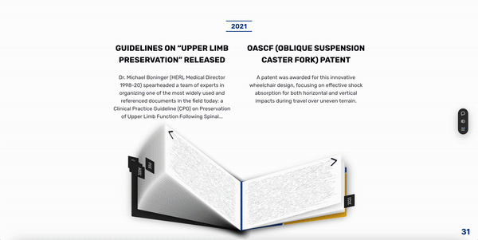
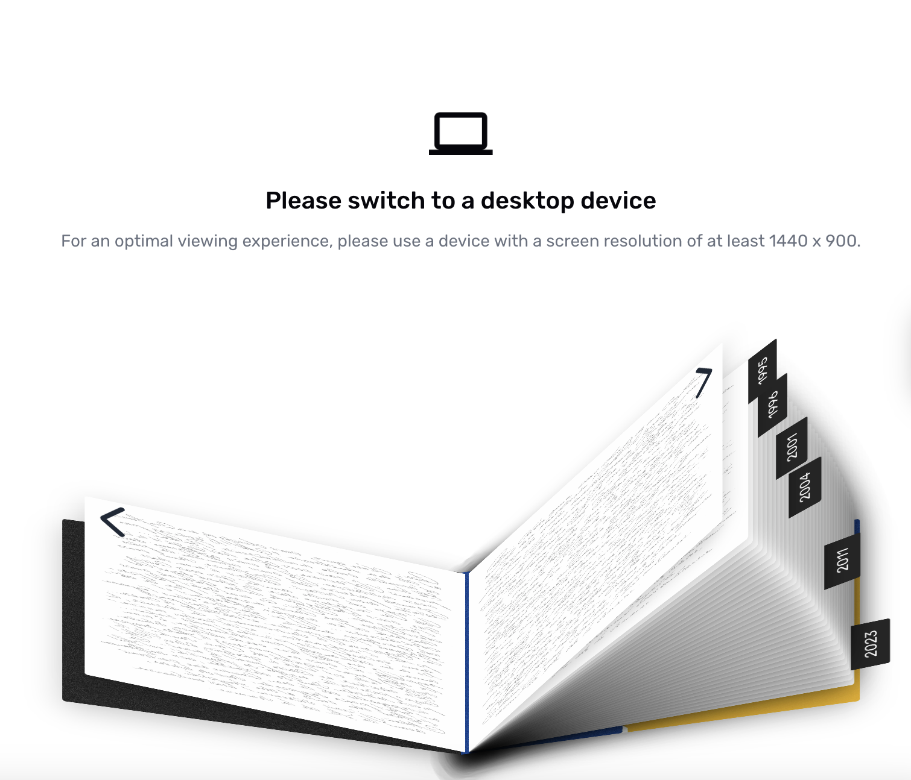

# Final Week

Final Deployment: https://herl-digital-narrative.vercel.app

### New Features!

- Book flips to backside when clicking past the last page
- Updated bookmarks to more relevant years, rather than simply 5-year intervals
- Updated the "Skip Ahead!" prompt with a nicer looking arrow svg
- Added more images to fill the layout from HERL resources & patents
- Switched the device rotation prompt to a switch devices prompt, as mobile is not officially supported
- Page numbers listed on the bottom right to make it easier to track your place in the book.

### Implementation Details

**Book Flip**

Trying to handle reaching the end of the book was hard, because there were multiple booleans keeping track of state that were deeply rooted in the codebase and triggered a lot of reactivity. Because of this, it was hard to get the animation perfect, but I tried my best to work within the constraints that I had to make an animation that would adequately convey the "backward closing" of the book.

**Bookmarks**

The bookmark titles were changed from 1996, 2002, 2006, 2010, 2013, and 2021 to 1995, 1996, 2001, 2004, 2011, and 2023. While the latter set of years is less consistently spaced apart, I found it important to highlight the most relevant years in the quick navigation. Even if it takes longer to find a given year, I find the tradeoff worth it.

**Skip Ahead! Prompt**

The curving arrow is more aethetically pleasing. It also avoids an issue where Chromium based browsers would try to substitute the unicode for an ugly looking emoji.

| New Prompt                          | Old Prompt                          | Old Prompt (Chromium)                      |
| ----------------------------------- | ----------------------------------- | ------------------------------------------ |
|  |  |  |

**New Images**

Since the layout was a little sparse on some pages, I decided to include some supplemental images from HERL's backlog, as well as some patent diagrams I found on the USPTO. Here are a few of them:

**New Device Width Prompt**

The existing prompt was misleading, since rotating the device wouldn't make the layout function anyways. The new one is more transparent and guides users in the right direction, even if it's more work on their end.

| Old Prompt                                        | New Prompt                                              |
| ------------------------------------------------- | ------------------------------------------------------- |
|  |  |

**Page Numbers**

Pretty self explanatory.

And it's done!! It's so nice to see this project packed away and over. These journal entries will be compiled and converted into a case study on https://liambsullivan.com very soon, so stay tuned.

Until next project,

LS
