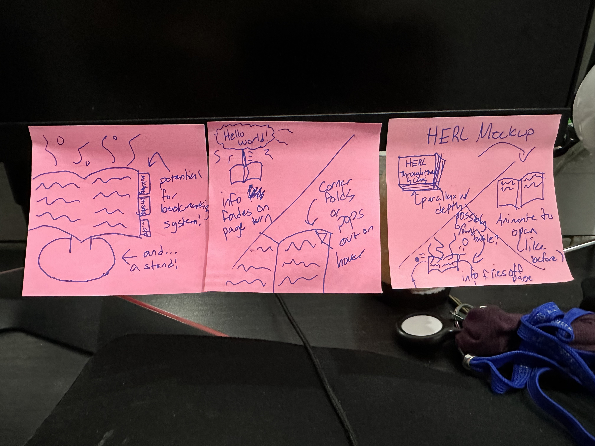

# Week 1

This week involved a lot of planning and storyboarding! I knew going in that I wanted to create a skeumorphic layout. Since the assets given to me were in booklet format, I wanted to utilize said book as a visual metaphor in my layout, instead of retrofitting the assets into a different form of visual presentation.

Agustin told me that he plans to put the final product in an iframe, so that gave me a couple of restrictions.

- The content must be readable in a small window. Mobile viewers will be especially impacted.
- Scrolling should be avoided since the content is embedded. Making the user scroll in such a small space is confusing and disorienting.
- Content needs to be performant. The HERL website will introduce extra overhead.

These principles heavily influenced my design methodology, as you'll see below.

### Framework

To address my performance concerns, I needed to use tools that produced as little overhead as possible, while also being flexible enough to afford state, listeners, and other interactions.

React is a great tool, and would work well for the level of interactivity for this project, but it relies on a Virtual DOM (Document Object Model). The VDOM would need to be shipped with any JavaScript I write, which would be a lot for an embed. A lot of the popular frameworks have this issue.

This brings me to Svelte. It lacks the large community that React has, but it is **fast**. It is distinct in that it compiles down to native JavaScript when built without relying on any additional layers of abstraction. Because of this, I decided on it to build out this project.

### The Mockup

I started by drawing out some quick sketches on stickies, since my iPad wasn't charged at the time.

To keep the content readable for all users, I planned to make the book itself take up the majority of the page, open or closed. The book should be interacted with by click. Hover effects are a nicety, but they should never be a requirement for the interface, since mobile users can't use a mouse to interact with the app.

### Graphics

I began researching options to create visuals that would convey this visual metaphor. I settled on Three.js, a JavaScript library that uses WebGL to display 3D models in the browser itself. To my luck, there was already a Svelte wrapper for it called **Threlte**.

There were a couple of issues with this approach though. For one, I have zero experience with 3D modelling and animation. This would be a significant hurdle I'd have to jump. I looked at creative commons and found book models to use, but many of them were too stylized to work outside of a fantasy setting.

Eventually, I started building the book from scratch, creating 2D planes for pages. It worked, even while embedded in other sites which I wasn't expecting.

Even still, animation is an issue, and I learned that Threlte doesn't offer the option of animating specific verticies of the model. While Three.js itself would allow for this, I didn't want to fight the framework. Since I am developing a product with a timetable, I didn't want to fiddle with technology that I wasn't confident in being able to ship.

I eventually decided to ship Svelte with plain ol' HTML and CSS. By using `transform-style: preserve-3d`, I could create 3D animations that looked convincing enough, while still running well in the majority of modern browsers.

Using TypeScript (a compiler that extends JavaScript with types like number and string), I created a holographic effect that makes the book feel tangible. I also created the starting animation that plays when the book is clicked.

That is all I got done for this week. Next week will focus on creating the logic for flipping the pages and animating the content so it floats off the pages.

LS
