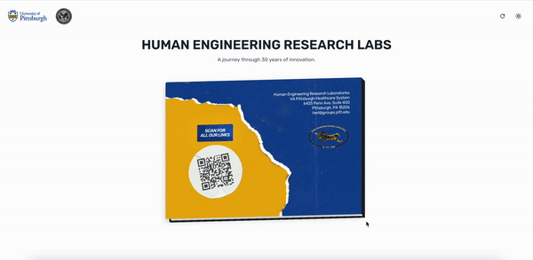
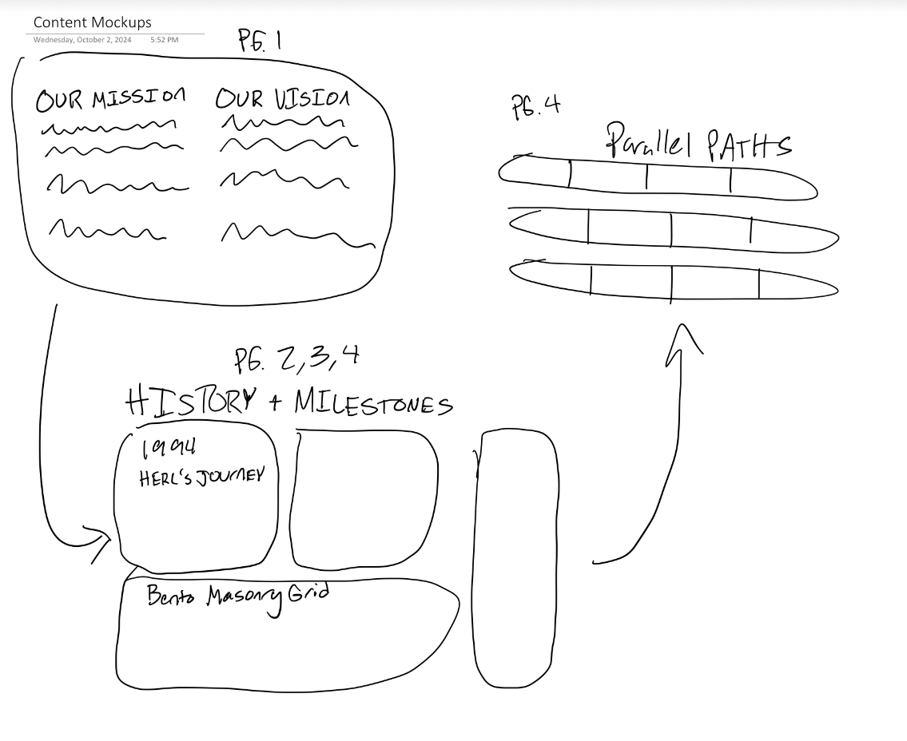

# Week 2

Current Deployment: https://herl-digital-narrative-jdho57dmb-liambsullivas-projects.vercel.app

### New Features!

- Title text fades out when book is opened
- Page navigation with arrows on book OR arrow keys on keyboard (works to open/close book too!)
- Ability to flip book when closed to see back cover
- Updated back cover in accordance with HERL assets
- Added placeholder content for each page, will be animated + fleshed out later.

### Animation

A sticking point for this week was properly handling the page transitions. At first, I was using CSS rules to animate the pages, but as the animations began to overlap and increase in complexity, I realized I needed to use JavaScript (TS in this case) to handle the animations. Moving all of the logic into script-land was time consuming. I had to reconcile with the interpreter because JS runs asynchronously, and I had to account for the time the code takes to run and delay scripts accordingly. Despite all of this, moving the animations to this dynamic format was still worth it for the flexibility it brought.

Tangentially related, manipulating elements in 3D space is a whole different ball game. Trying conceptualize what a given rotation will do is tough when all of the pages look the same. Oftentimes I would mix up a page's rotation and scale and try to implement navigation on it, only to realize I was manipulating the wrong page. There was a lot of debugging involved.

### Back Cover

I needed some way to let the user see the back cover, since it has the QR code and HERL contact information. I decided to use a flip button to do so. Trying to sequence the animations when the book is open was so difficult that I decided to only make it available when the book is closed.

Despite this, the book can still be opened while it's flipped. In the best happy accident ever, the animation looks totally awesome.

### Content

Looking at the deployment as is, the content is still pretty half-baked. This is intentional. I'm working on a way to display the content in a way that is responsive for smaller views, since this will ultimately be embedded in a larger website. I made some mockup sketches that I'll paste below.

As you can see above, I see the Our Mission + Our Vision sections ending up fairly visually similar in the final product. Because of the digital format, I plan to update the History and Milestones sections to use the "bento" style that has become popular in the web world in recent years. For more examples of this style, look here: https://bentogrids.com/ It'll also encompass the bulk of the pages since there is so much content to cover.

For Parallel Paths, I like the timeline metaphor in the original booklet, and I don't see a reason why it couldn't be replicated in a digital format. I could see myself animating the bars themselves in due time as well, but that would be a stretch goal. All in all, I think this week was very productive, and I am excited to finally start fleshing out the page content next week.

LS
