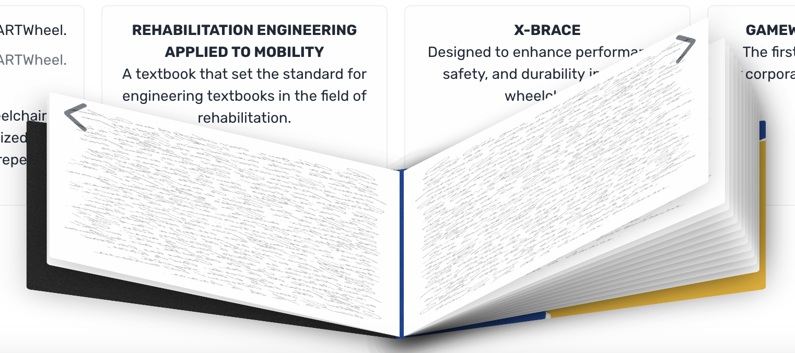

# Week 4

Current Deployment: https://herl-digital-narrative-nqwwy4xvx-liambsullivas-projects.vercel.app

### New Features!

- Milestones are fully present and laid out on the page by year
- Scrollable with a generous bottom margin so all the content is viewable
- Content window is responsive such that it doesn't overflow when the screen is small.
- Fake text on book pages to lean into the skeumorphic design

**Known Bugs**

- Images aren't properly rendering in the live demo, despite them working locally
- Next arrow on book doesn't work when clicked. Using arrow keys for now
- Text on pages leads to performance issues if the book is quickly flipped through

### Content

The milestones are finally imported in its entirety with their associated images! The layout is definitely not perfect, and there are a lot of kinks to iron out, but the app is finally in a usable state. The coming weeks will involve a lot of UX tweaks to make the experience more cohesive in the smaller footprint of the iframe.

### Fake Text

I have added a cursive text texture I grabbed from Adobe Stock to lean into the skeumorphic design of the book. From what I can tell, it's leading to some performance issues. I'm going to see if I can compress the photo in some way or use some kind of vector to ease the load on the browser. We'll have to see.

### Layout

So far, the page is laid out so that users need to scroll to see all of the content. I needed to do this because there is so much content to display that it is difficult to show it without the book getting in the way. This is something that I plan to address in the future, whether it be through creatively resizing things based on screen size or just allowing users to expand specific milestones by clicking on them. The layout is a pretty big UX challenge for this project, and it will take a couple more weeks of work to get it in a state that I am comfortable with.

We're in the home stretch! Just need to test, test, test and throw in some quality of life features.

LS
