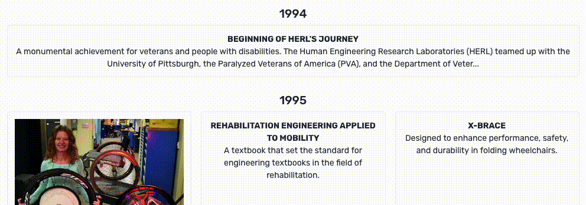

# Week 5

Current Deployment: https://herl-digital-narrative-iqcmlj2hd-liambsullivas-projects.vercel.app

### New Features!

- Lightbox view for photos. Can enlarge them on smaller screens
- Long descriptions can be hidden/expanded for space savings

**Known Bugs (Unchanged)**

- Images aren't properly rendering in the live demo, despite them working locally
- Next arrow on book doesn't work when clicked. Using arrow keys for now
- Text on pages leads to performance issues if the book is quickly flipped through

### Description Shortening

This was a slow week. Shoutout to my program advisor for giving me suggestions for the features I implemented this week (thanks Mav!)

The description shortening was pretty easy to implement in large part because I already had the code for it on hand. I keep little code snippets in my notes for broadly applicable features like this to save time. This is literally all it took:

```ts
const getTruncatedDescription = (description: string, maxLength: number) => {
  if (description.length <= maxLength) {
    return description;
  }

  const truncated = description.substring(0, maxLength - 3);
  return truncated + "...";
};

let truncateDescription = getTruncatedDescription(
  `Lorem ipsum dolor sit amet, consectetur adipiscing elit. Sed non risus. Suspendisse lectus tortor, dignissim sit amet, adipiscing nec, ultricies sed, dolor. Cras elementum ultrices diam. Maecenas ligula massa, varius a, semper congue, euismod non, mi. Proin porttitor, orci nec nonummy molestie, enim est eleifend mi, non fermentum diam nisl sit amet erat.`,
  100,
);
```

You throw in the text you want shortened and the length to shorten it to (100 characters in this case), and it handles it for you.



### Implementing the Lightbox

This one was a little painful to implement, because the package I am using hasn't been reconfigured to work on the newest version of the framework I'm using (Svelte 5). To rectify this, I needed to tell the compiler to ignore the error messages and press on. It only took a single command, but I needed to use it locally AND override my hosting service's build process with

`npm i --legacy-peer-deps`

And now we can enlarge photos! Yay! With that said, I will need to be careful, as any conflicting packages I rely on from now on will run unchecked, meaning I may have some wierd error messages to debug in the following weeks as the project grows. Anyway, here's what it looks like.


Praying for no code conflicts in the future 🙏

LS
